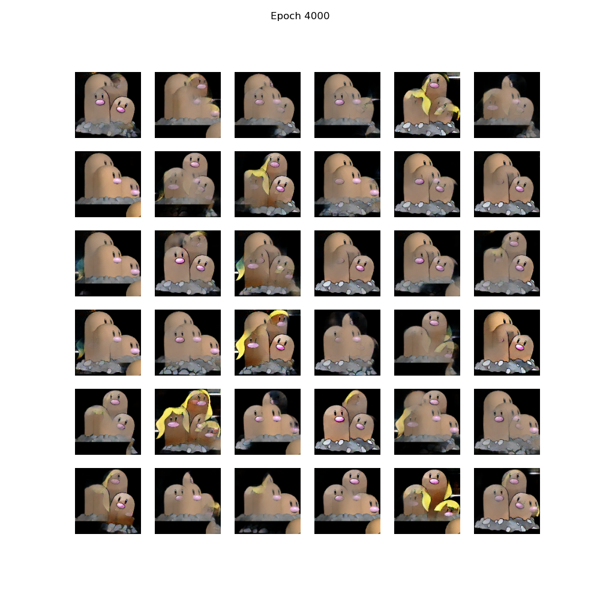

# Pokemon_gan

This project implement a DCGAN to generate 36 new fake images for each pokemon in dataset.

Reference:
https://www.tensorflow.org/tutorials/generative/dcgan

Dataset:
https://www.kaggle.com/lantian773030/pokemonclassification

- [Pokemon_gan](#pokemon_gan)
  - [Prepare the data set](#prepare-the-data-set)
  - [Build Model:](#build-model)
    - [Generator:](#generator)
    - [Discriminator](#discriminator)
  - [Define Loss and  optimizer](#define-loss-and--optimizer)
  - [Define the training loop](#define-the-training-loop)
  - [Train the model](#train-the-model)
  - [Result:](#result)
## Prepare the data set
```python
BATCH_SIZE = 64
BATCH_SIZE = 64
IMAGE_SIZE = 128  # reduce this to increase performance
IMAGE_CHANNELS = 3  # can be 3 (RGB) or 1 (Grayscale)
LATENT_SPACE_DIM = 100  # dimensions of the latent space that is used to generate the images


def create_dataset(dir):
    def preprocess(file_path):
        image = tf.io.read_file(file_path)
        image = tf.image.decode_jpeg(image, channels = 3)
        image = tf.image.resize(image, [128, 128])
        image = (image - 127.5) / 127.5
        return image


    def filter(image):
        return image[0, 0, 0] == -1

    def configure_for_performance(ds):
        ds = ds.cache()
        ds = ds.filter(filter)
        ds = ds.shuffle(buffer_size=1000)
        ds = ds.batch(BATCH_SIZE)
        ds = ds.prefetch(buffer_size=AUTOTUNE)
        return ds

    list_ds = tf.data.Dataset.list_files(dir, shuffle=True)
    train_dataset = list_ds.take(-1)

    train_dataset = train_dataset.map(preprocess, num_parallel_calls=AUTOTUNE)
    train_dataset = configure_for_performance(train_dataset)

    return train_dataset
```

## Build Model:

### Generator:

```python
def make_generator_model():
    model = tf.keras.Sequential()
    
    n = IMAGE_SIZE // 4
    
    model.add(layers.Dense(n * n * 256, use_bias=False, input_shape=(LATENT_SPACE_DIM,)))
    model.add(layers.BatchNormalization())
    model.add(layers.LeakyReLU())

    model.add(layers.Reshape((n, n, 256)))

    model.add(layers.Conv2DTranspose(128, (5, 5), strides=(1, 1), padding='same', use_bias=False))
    model.add(layers.BatchNormalization())
    model.add(layers.LeakyReLU())

    model.add(layers.Conv2DTranspose(64, (5, 5), strides=(2, 2), padding='same', use_bias=False))
    model.add(layers.BatchNormalization())
    model.add(layers.LeakyReLU())

    model.add(layers.Conv2DTranspose(IMAGE_CHANNELS, (5, 5), strides=(2, 2), padding='same', use_bias=False, activation='tanh'))

    return model
```

### Discriminator

```python
def make_discriminator_model():
    model = tf.keras.Sequential()
    model.add(layers.Conv2D(64, (5, 5), strides=(2, 2), padding='same',
                                     input_shape=[28, 28, 1]))
    model.add(layers.LeakyReLU())
    model.add(layers.Dropout(0.3))

    model.add(layers.Conv2D(128, (5, 5), strides=(2, 2), padding='same'))
    model.add(layers.LeakyReLU())
    model.add(layers.Dropout(0.3))

    model.add(layers.Flatten())
    model.add(layers.Dense(1))

    return model
```

## Define Loss and  optimizer
```python
cross_entropy = tf.keras.losses.BinaryCrossentropy(from_logits=True)

def discriminator_loss(real_output, fake_output):
    real_loss = cross_entropy(tf.ones_like(real_output), real_output)
    fake_loss = cross_entropy(tf.zeros_like(fake_output), fake_output)
    total_loss = real_loss + fake_loss
    return total_loss

def generator_loss(fake_output):
    return cross_entropy(tf.ones_like(fake_output), fake_output)

generator_optimizer = tf.keras.optimizers.Adam(1e-4)
discriminator_optimizer = tf.keras.optimizers.Adam(1e-4)
```

## Define the training loop
```python
def train_step(images):
    noise = tf.random.normal([BATCH_SIZE, LATENT_SPACE_DIM])

    with tf.GradientTape() as gen_tape, tf.GradientTape() as disc_tape:
        generated_images = generator(noise, training=True)

        real_output = discriminator(images, training=True)
        fake_output = discriminator(generated_images, training=True)

        gen_loss = generator_loss(fake_output)
        disc_loss = discriminator_loss(real_output, fake_output)

        gradients_of_generator = gen_tape.gradient(gen_loss, generator.trainable_variables)
        gradients_of_discriminator = disc_tape.gradient(disc_loss, discriminator.trainable_variables)

        generator_optimizer.apply_gradients(zip(gradients_of_generator, generator.trainable_variables))
        discriminator_optimizer.apply_gradients(zip(gradients_of_discriminator, discriminator.trainable_variables))


num_examples_to_generate = 36
seed = tf.random.normal([num_examples_to_generate, LATENT_SPACE_DIM])

def train(dataset, epochs, save_after, save_URL):
    
    generate_and_save_images(generator, 0, seed, save_URL)
    
    for epoch in range(epochs):
        start = time.time()

        for image_batch in dataset:
            train_step(image_batch)

        if (epoch + 1) % save_after == 0:
            display.clear_output(wait=True)
            generate_and_save_images(generator, epoch + 1, seed, save_URL)

        print ('Time for epoch {} is {} sec'.format(epoch + 1, time.time()-start))

    display.clear_output(wait=True)
    generate_and_save_images(generator, epochs, seed, save_URL)

def generate_and_save_images(model, epoch, test_input, save_URL):
    predictions = model(test_input, training=False)

    fig = plt.figure(figsize=(10, 10))

    for i in range(predictions.shape[0]):
        plt.subplot(6, 6, i + 1)
        if predictions.shape[-1] == 3:
            plt.imshow(predictions[i] * 0.5 + .5)
        else: 
            plt.imshow(predictions[i, :, :, 0] * 0.5 + .5, cmap='gray')
        plt.axis('off')
    plt.suptitle(f'Epoch {epoch}')
    plt.savefig('image_at_epoch_{:04d}.png'.format(epoch))
    plt.show()

    if (epoch % 100 == 0):
        for i in range(predictions.shape[0]):
            imagearray = predictions[i].numpy() * 127.5 + 127.58
            imageio.imwrite(str(save_URL + str(i) + ".jpeg"), imagearray)
```

## Train the model
```
pokemon_class = ['Spearow']

for pokemon in pokemon_class:
    train_dataset = create_dataset("./PokemonData/" + str(pokemon) + "/*")
    save = str("./savedData/" + str(pokemon) + "/")
    
    train(train_dataset, epochs=2000, save_after=100, save_URL = save)
```

## Result:
<p align="center">
	
	<p align="center">
</p>